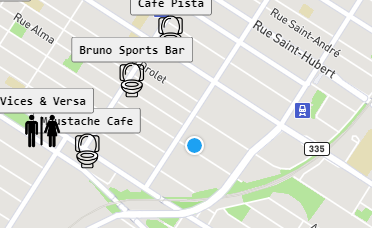
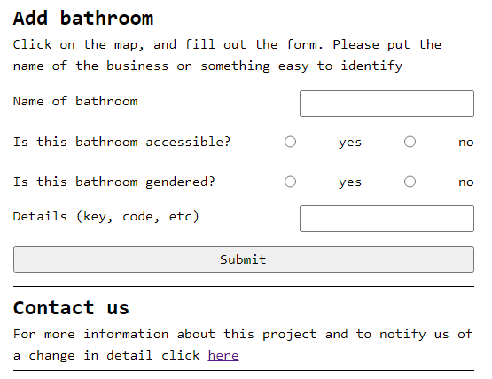

# BathroomsMontreal

Bathrooms Montreal is a collaboration between Oliver Mercer-Smail and Tristan Giardini. This project is the first 'post bootcamp' project for them. The idea is a simple one: when you need to use a washroom, you should be able to.

Bathrooms montreal is a user based platform where you can geolocate yourself and find a nearby bathroom to use. Users can also input a public bathroom to the map, or contact us about any concerns.

Accessibility is important to us, and we want to use tech to make the world more accessible.

This project uses Mapbox API, and emailJS.

Feel free to get in touch: olivermercersmail@gmail.com or tristangiardini@gmail.com